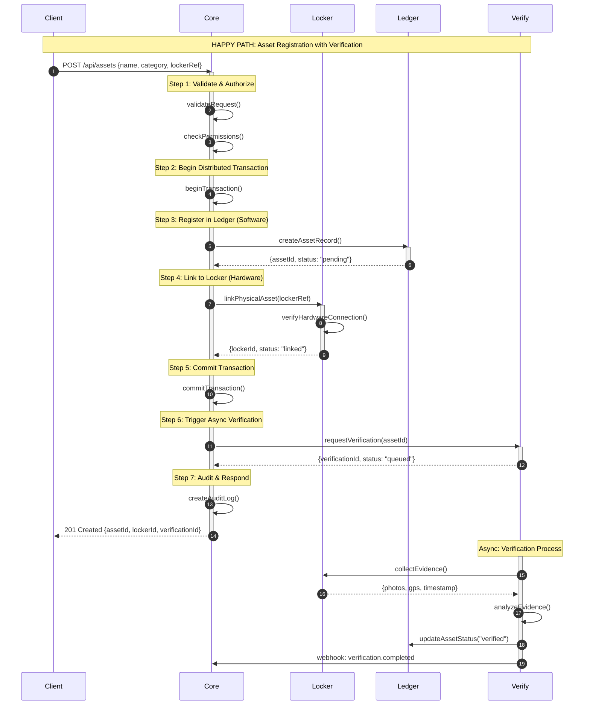
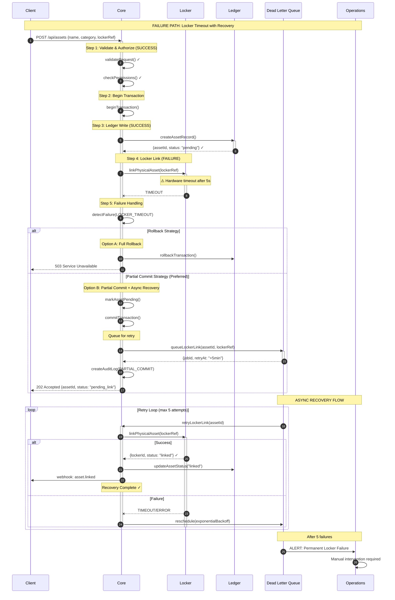
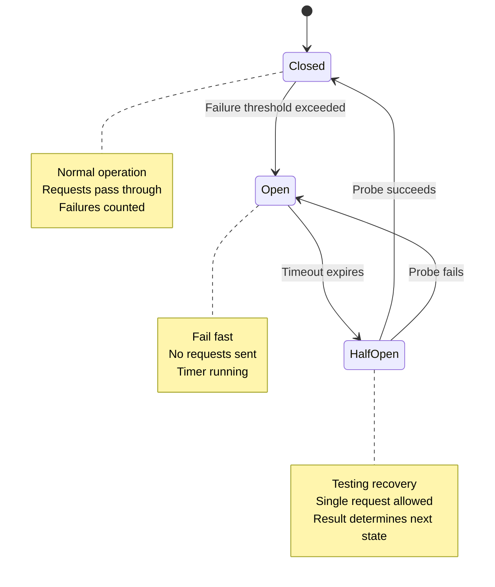

# C100: THE NERVOUS SYSTEM
## Core Orchestration of Hardware (Locker) & Software (Ledger)

```
╔══════════════════════════════════════════════════════════════════════════════╗
║  [DEAN] CURRICULUM ARTIFACT                                                  ║
║  ═══════════════════════════════════════════════════════════════════════════ ║
║                                                                              ║
║  Track:        C100 - The Nervous System                                     ║
║  Module:       Core Orchestration Deep Dive                                  ║
║  Voice:        Google SRE Handbook                                           ║
║  Duration:     4 hours                                                       ║
║                                                                              ║
║  "Hope is not a strategy."                                                   ║
║                 — Google SRE Handbook, Chapter 1                             ║
║                                                                              ║
╚══════════════════════════════════════════════════════════════════════════════╝
```

---

## 1. Introduction: The Orchestration Problem

Proveniq Core does not exist in isolation. It is the **central nervous system** that coordinates two fundamentally different subsystems:

| Subsystem | Codename | Nature | Failure Mode |
|-----------|----------|--------|--------------|
| **Hardware Layer** | Locker | Physical assets, IoT devices, secure storage | Latency, connectivity loss, hardware failure |
| **Software Layer** | Ledger | Financial records, transactions, audit trails | Data corruption, consistency violations, calculation errors |

The challenge: these subsystems have **incompatible reliability characteristics**.

- **Locker** operates in the physical world where network partitions are common
- **Ledger** requires ACID guarantees where partial writes are catastrophic

Core must bridge this gap. This module teaches you how.

---

## 2. The Orchestration Model

### 2.1 Core as the Control Plane

```
┌─────────────────────────────────────────────────────────────────────────────┐
│                        PROVENIQ ORCHESTRATION MODEL                          │
├─────────────────────────────────────────────────────────────────────────────┤
│                                                                             │
│                              ┌─────────────┐                                │
│                              │             │                                │
│                              │    CORE     │                                │
│                              │  (Control)  │                                │
│                              │             │                                │
│                              └──────┬──────┘                                │
│                                     │                                       │
│                    ┌────────────────┼────────────────┐                     │
│                    │                │                │                      │
│                    ▼                ▼                ▼                      │
│             ┌──────────┐     ┌──────────┐     ┌──────────┐                 │
│             │  LOCKER  │     │  LEDGER  │     │  VERIFY  │                 │
│             │(Hardware)│     │(Software)│     │ (Hybrid) │                 │
│             └──────────┘     └──────────┘     └──────────┘                 │
│                    │                │                │                      │
│                    │                │                │                      │
│             ┌──────▼──────┐  ┌──────▼──────┐  ┌──────▼──────┐              │
│             │ IoT Devices │  │  PostgreSQL │  │  Evidence   │              │
│             │ Secure Vaults│  │  Ledger DB  │  │  Storage    │              │
│             │ Physical Keys│  │  Audit Logs │  │  ML Models  │              │
│             └─────────────┘  └─────────────┘  └─────────────┘              │
│                                                                             │
│  CONTROL PLANE: Core manages state, routing, and failure handling          │
│  DATA PLANE: Subsystems handle domain-specific operations                   │
│                                                                             │
└─────────────────────────────────────────────────────────────────────────────┘
```

### 2.2 Subsystem Characteristics

```typescript
const SUBSYSTEM_PROFILES = {
  locker: {
    name: "Locker (Hardware)",
    latency: {
      p50: 500,      // ms - physical operations are slow
      p99: 5000,     // ms - network partitions common
      timeout: 30000 // ms - must wait for hardware
    },
    consistency: "eventual",
    availability: 0.995,  // 99.5% - hardware fails
    failureMode: "graceful_degradation",
    retryStrategy: "exponential_backoff",
    idempotency: "required"
  },
  
  ledger: {
    name: "Ledger (Software)",
    latency: {
      p50: 20,       // ms - database operations
      p99: 200,      // ms - complex transactions
      timeout: 5000  // ms - fail fast
    },
    consistency: "strong",
    availability: 0.9999, // 99.99% - software is reliable
    failureMode: "fail_closed",
    retryStrategy: "immediate_with_backoff",
    idempotency: "required"
  },
  
  verify: {
    name: "Verify (Hybrid)",
    latency: {
      p50: 2000,     // ms - evidence collection
      p99: 30000,    // ms - human-in-loop possible
      timeout: 86400000 // ms - 24 hours for manual review
    },
    consistency: "eventual_with_checkpoints",
    availability: 0.999,
    failureMode: "queue_and_retry",
    retryStrategy: "scheduled",
    idempotency: "required"
  }
} as const;
```

---

## 3. The Happy Path: When Everything Works

### 3.1 Sequence Diagram



### 3.2 Happy Path Timing Budget

| Step | Operation | Target | Max |
|------|-----------|--------|-----|
| 1 | Validate & Authorize | 20ms | 50ms |
| 2 | Begin Transaction | 5ms | 10ms |
| 3 | Ledger Write | 30ms | 100ms |
| 4 | Locker Link | 200ms | 2000ms |
| 5 | Commit Transaction | 10ms | 50ms |
| 6 | Queue Verification | 5ms | 20ms |
| 7 | Audit & Respond | 10ms | 30ms |
| **Total** | **Synchronous Path** | **280ms** | **2260ms** |

**SLO Definition:**
- P50: < 500ms
- P95: < 1500ms
- P99: < 3000ms

---

## 4. The Failure Path: When Things Go Wrong

### 4.1 Failure Taxonomy

```typescript
const FAILURE_MODES = {
  // Locker (Hardware) Failures
  LOCKER_TIMEOUT: {
    code: "E_LOCKER_TIMEOUT",
    severity: "degraded",
    action: "queue_for_retry",
    userMessage: "Physical asset linking delayed. Will retry automatically.",
    slaImpact: false
  },
  LOCKER_UNREACHABLE: {
    code: "E_LOCKER_UNREACHABLE",
    severity: "degraded",
    action: "create_pending_link",
    userMessage: "Hardware temporarily unavailable. Asset created in pending state.",
    slaImpact: false
  },
  LOCKER_HARDWARE_FAILURE: {
    code: "E_LOCKER_HARDWARE",
    severity: "critical",
    action: "alert_operations",
    userMessage: "Hardware error detected. Operations team notified.",
    slaImpact: true
  },
  
  // Ledger (Software) Failures
  LEDGER_CONSTRAINT_VIOLATION: {
    code: "E_LEDGER_CONSTRAINT",
    severity: "error",
    action: "reject_request",
    userMessage: "Invalid data. Please check your input.",
    slaImpact: false
  },
  LEDGER_TRANSACTION_CONFLICT: {
    code: "E_LEDGER_CONFLICT",
    severity: "warning",
    action: "retry_with_backoff",
    userMessage: "Concurrent modification detected. Please retry.",
    slaImpact: false
  },
  LEDGER_DATABASE_DOWN: {
    code: "E_LEDGER_DOWN",
    severity: "critical",
    action: "circuit_breaker",
    userMessage: "Service temporarily unavailable. Please try again later.",
    slaImpact: true
  },
  
  // Orchestration Failures
  PARTIAL_COMMIT: {
    code: "E_PARTIAL_COMMIT",
    severity: "critical",
    action: "compensating_transaction",
    userMessage: "Operation partially completed. Automatic recovery in progress.",
    slaImpact: true
  },
  TIMEOUT_AFTER_COMMIT: {
    code: "E_TIMEOUT_POST_COMMIT",
    severity: "warning",
    action: "async_completion",
    userMessage: "Operation completed. Some updates may be delayed.",
    slaImpact: false
  }
} as const;
```

### 4.2 Failure Path Sequence Diagram



### 4.3 Failure Recovery Matrix

| Failure Type | Detection | Immediate Action | Recovery Strategy | Escalation |
|--------------|-----------|------------------|-------------------|------------|
| Locker Timeout | 5s timeout | Partial commit | Async retry (5x) | After 5 failures |
| Locker Unreachable | Connection refused | Queue pending | Retry on reconnect | After 1 hour |
| Locker Hardware | Error response | Alert ops | Manual intervention | Immediate |
| Ledger Constraint | DB error | Reject request | User correction | None |
| Ledger Conflict | Version mismatch | Retry (3x) | User retry | After 3 failures |
| Ledger Down | Connection failed | Circuit breaker | Wait for recovery | Immediate |
| Partial Commit | Mixed results | Compensating txn | Saga rollback | After failure |

---

## 5. The Saga Pattern: Distributed Transaction Management

### 5.1 Why Sagas?

Traditional two-phase commit (2PC) doesn't work when:
- One subsystem (Locker) has high latency
- Network partitions are common
- Availability is prioritized over consistency

**Saga Pattern**: Break the transaction into steps, each with a compensating action.

### 5.2 Asset Registration Saga

```typescript
interface SagaStep<T> {
  name: string;
  execute: () => Promise<T>;
  compensate: () => Promise<void>;
  timeout: number;
  retries: number;
}

const ASSET_REGISTRATION_SAGA: SagaStep<unknown>[] = [
  {
    name: "create_ledger_record",
    execute: async () => {
      return await ledger.createAsset({
        name,
        category,
        status: "pending",
      });
    },
    compensate: async () => {
      await ledger.deleteAsset(assetId);
    },
    timeout: 5000,
    retries: 3,
  },
  {
    name: "link_locker",
    execute: async () => {
      return await locker.linkAsset(assetId, lockerRef);
    },
    compensate: async () => {
      await locker.unlinkAsset(assetId);
    },
    timeout: 30000,
    retries: 5,
  },
  {
    name: "update_status",
    execute: async () => {
      return await ledger.updateAssetStatus(assetId, "linked");
    },
    compensate: async () => {
      await ledger.updateAssetStatus(assetId, "pending");
    },
    timeout: 5000,
    retries: 3,
  },
  {
    name: "queue_verification",
    execute: async () => {
      return await verify.queueVerification(assetId);
    },
    compensate: async () => {
      await verify.cancelVerification(assetId);
    },
    timeout: 5000,
    retries: 3,
  },
];

async function executeSaga(steps: SagaStep<unknown>[]): Promise<void> {
  const completed: SagaStep<unknown>[] = [];
  
  for (const step of steps) {
    try {
      await withRetry(
        () => withTimeout(step.execute(), step.timeout),
        step.retries
      );
      completed.push(step);
    } catch (error) {
      // Compensate in reverse order
      for (const completedStep of completed.reverse()) {
        try {
          await completedStep.compensate();
        } catch (compensateError) {
          // Log but continue compensating
          logger.error("Compensation failed", {
            step: completedStep.name,
            error: compensateError,
          });
        }
      }
      throw new SagaFailedError(step.name, error);
    }
  }
}
```

---

## 6. Circuit Breakers: Protecting the System

### 6.1 Circuit Breaker States



### 6.2 Circuit Breaker Configuration

```typescript
const CIRCUIT_BREAKER_CONFIG = {
  locker: {
    name: "locker-circuit",
    failureThreshold: 5,        // Open after 5 failures
    successThreshold: 3,        // Close after 3 successes
    timeout: 30000,             // Stay open for 30s
    volumeThreshold: 10,        // Minimum requests before tripping
    errorFilter: (error: Error) => {
      // Only count network errors, not validation errors
      return error.name === "NetworkError" || 
             error.name === "TimeoutError";
    },
  },
  
  ledger: {
    name: "ledger-circuit",
    failureThreshold: 3,        // More sensitive
    successThreshold: 2,
    timeout: 10000,             // Shorter timeout
    volumeThreshold: 5,
    errorFilter: (error: Error) => {
      return error.name === "DatabaseError" ||
             error.name === "ConnectionError";
    },
  },
} as const;
```

---

## 7. Observability: Knowing What's Happening

### 7.1 Key Metrics

```typescript
const ORCHESTRATION_METRICS = {
  // Latency metrics
  "core.orchestration.latency": {
    type: "histogram",
    labels: ["subsystem", "operation", "status"],
    buckets: [10, 50, 100, 250, 500, 1000, 2500, 5000, 10000],
  },
  
  // Success/failure rates
  "core.orchestration.requests": {
    type: "counter",
    labels: ["subsystem", "operation", "status"],
  },
  
  // Circuit breaker state
  "core.circuit_breaker.state": {
    type: "gauge",
    labels: ["circuit", "state"],
    values: { closed: 0, open: 1, half_open: 2 },
  },
  
  // Saga execution
  "core.saga.duration": {
    type: "histogram",
    labels: ["saga", "outcome"],
  },
  "core.saga.compensations": {
    type: "counter",
    labels: ["saga", "step"],
  },
  
  // Queue depths
  "core.dlq.depth": {
    type: "gauge",
    labels: ["queue"],
  },
} as const;
```

### 7.2 Alerting Rules

```yaml
# Prometheus alerting rules
groups:
  - name: orchestration
    rules:
      - alert: LockerCircuitOpen
        expr: core_circuit_breaker_state{circuit="locker", state="open"} == 1
        for: 5m
        labels:
          severity: warning
        annotations:
          summary: "Locker circuit breaker is open"
          description: "Hardware subsystem may be experiencing issues"

      - alert: LedgerCircuitOpen
        expr: core_circuit_breaker_state{circuit="ledger", state="open"} == 1
        for: 1m
        labels:
          severity: critical
        annotations:
          summary: "Ledger circuit breaker is open"
          description: "Database subsystem is down. Immediate action required."

      - alert: HighSagaCompensationRate
        expr: rate(core_saga_compensations_total[5m]) > 0.1
        for: 5m
        labels:
          severity: warning
        annotations:
          summary: "High saga compensation rate"
          description: "More than 10% of sagas are failing and compensating"

      - alert: DLQBacklog
        expr: core_dlq_depth > 1000
        for: 15m
        labels:
          severity: warning
        annotations:
          summary: "Dead letter queue backlog growing"
          description: "{{ $value }} items in DLQ. Check for systematic failures."
```

---

## 8. Knowledge Check

### Questions

1. **Why can't we use traditional 2PC for Core ↔ Locker transactions?**

2. **What is the difference between "fail closed" and "graceful degradation"?**

3. **In the failure path diagram, why do we prefer partial commit over full rollback?**

4. **What triggers a circuit breaker to move from Closed to Open?**

5. **How does the Saga pattern handle a failure in step 3 of 4?**

6. **What is the SLO for the happy path synchronous response?**

7. **Why does Locker have a higher timeout (30s) than Ledger (5s)?**

8. **What happens after 5 failed retry attempts for a Locker link?**

### Answers

1. Locker has high latency and network partitions. 2PC requires all participants to be available and responsive, which Locker cannot guarantee.

2. "Fail closed" means reject all requests when unhealthy (Ledger). "Graceful degradation" means continue with reduced functionality (Locker).

3. Partial commit preserves user progress and allows async recovery. Full rollback loses all work and requires user to retry.

4. When failure count exceeds threshold (5 for Locker, 3 for Ledger) within the volume threshold window.

5. Steps 1 and 2 are compensated in reverse order (2 first, then 1). The saga throws an error after compensation.

6. P50 < 500ms, P95 < 1500ms, P99 < 3000ms.

7. Locker involves physical hardware operations (network to device, mechanical actions). Ledger is pure software with predictable latency.

8. The job moves to dead letter queue and alerts operations for manual intervention.

---

## 9. Lab Exercise

### Exercise: Implement Failure Injection

Create a test that:
1. Simulates Locker timeout on the 3rd request
2. Verifies partial commit occurs
3. Confirms DLQ entry is created
4. Validates async recovery succeeds on retry

```typescript
describe("Orchestration Failure Handling", () => {
  it("should handle Locker timeout with partial commit", async () => {
    // Setup: Mock Locker to timeout on 3rd call
    let callCount = 0;
    mockLocker.linkAsset.mockImplementation(async () => {
      callCount++;
      if (callCount === 3) {
        await delay(35000); // Exceed timeout
      }
      return { lockerId: "locker_123" };
    });

    // Execute: Create asset
    const response = await request(app)
      .post("/api/assets")
      .send({ name: "Test", category: "equipment", lockerRef: "ref_123" });

    // Assert: Partial commit
    expect(response.status).toBe(202);
    expect(response.body.status).toBe("pending_link");

    // Assert: DLQ entry created
    const dlqEntry = await dlq.findByAssetId(response.body.assetId);
    expect(dlqEntry).toBeDefined();
    expect(dlqEntry.retryCount).toBe(0);

    // Simulate: DLQ retry
    await dlqProcessor.processNext();

    // Assert: Recovery succeeded
    const asset = await ledger.getAsset(response.body.assetId);
    expect(asset.status).toBe("linked");
  });
});
```

---

*[DEAN] Module complete. Core orchestration of Hardware (Locker) and Software (Ledger) documented with Happy Path and Failure Path diagrams.*

---

**Next Module:** [C100-02: Request Lifecycle Deep Dive](./c100-request-lifecycle.md)
