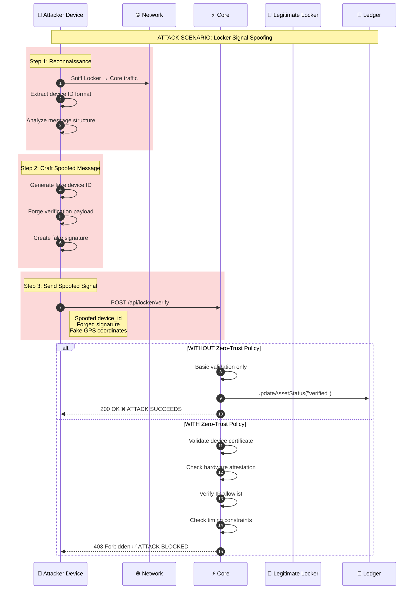

# LAB: Red Team - Locker Signal Spoofing
## C200: The Iron Gate

```
╔══════════════════════════════════════════════════════════════════════════════╗
║  [DRILL_INSTRUCTOR] RED TEAM SCENARIO                                        ║
║  ═══════════════════════════════════════════════════════════════════════════ ║
║                                                                              ║
║  Scenario:     LOCKER-SPOOF-001                                              ║
║  Classification: CRITICAL                                                    ║
║  Attack Vector: Hardware Signal Spoofing                                     ║
║  Duration:      120 minutes                                                  ║
║  Difficulty:    █████████░ 95%                                              ║
║                                                                              ║
║  ⚠️  ZERO-TRUST ARCHITECTURE REQUIRED                                       ║
║  "Never trust, always verify."                                               ║
║                                                                              ║
╚══════════════════════════════════════════════════════════════════════════════╝
```

---

## 🎯 MISSION BRIEFING

### Threat Intelligence Report

```
┌──────────────────────────────────────────────────────────────────────────────┐
│  THREAT INTELLIGENCE BULLETIN                                                │
│  Classification: CONFIDENTIAL                                                │
│  Date: 2024-01-15                                                           │
├──────────────────────────────────────────────────────────────────────────────┤
│                                                                              │
│  THREAT ACTOR: Unknown (APT-LOCKER)                                         │
│                                                                              │
│  ATTACK SUMMARY:                                                             │
│  An unauthorized device has been detected attempting to impersonate          │
│  legitimate Locker hardware. The attacker is sending fabricated             │
│  "asset verified" signals to Core, attempting to mark assets as             │
│  verified without actual physical verification.                              │
│                                                                              │
│  OBSERVED INDICATORS:                                                        │
│  • Spoofed device ID matching legitimate Locker format                      │
│  • Valid-looking but forged cryptographic signatures                        │
│  • Requests originating from unexpected IP ranges                           │
│  • Timing anomalies (responses faster than physically possible)             │
│  • Missing or invalid hardware attestation tokens                           │
│                                                                              │
│  POTENTIAL IMPACT:                                                           │
│  • Fraudulent asset verification                                            │
│  • Compromised audit trail integrity                                        │
│  • Financial losses from unverified assets                                  │
│  • Regulatory compliance violations                                         │
│                                                                              │
│  REQUIRED ACTION:                                                            │
│  Implement Zero-Trust policy to block this attack vector                    │
│                                                                              │
└──────────────────────────────────────────────────────────────────────────────┘
```

### Your Mission

1. Analyze the attack vector
2. Design a Zero-Trust policy that blocks the spoofing attempt
3. Implement the policy in `Policy.json` format
4. Validate the policy blocks all attack variations
5. Ensure legitimate Locker devices continue to function

---

## 📊 ATTACK ANALYSIS

### Attack Flow Diagram



### Attack Payload Example

```json
{
  "device_id": "LOCKER-2024-00847",
  "message_type": "VERIFICATION_COMPLETE",
  "asset_id": "asset_clx7k9m2n0001",
  "timestamp": "2024-01-15T14:32:17.000Z",
  "payload": {
    "verification_type": "EXISTENCE",
    "result": "VERIFIED",
    "confidence": 98.5,
    "evidence": {
      "photos": ["https://attacker.com/fake-photo.jpg"],
      "gps": {
        "lat": 40.7128,
        "lng": -74.0060
      },
      "hardware_reading": "SIMULATED"
    }
  },
  "signature": "FORGED_SIGNATURE_abc123..."
}
```

### Attack Indicators

| Indicator | Legitimate | Spoofed |
|-----------|------------|---------|
| Device Certificate | Valid, issued by Proveniq CA | Missing or self-signed |
| Hardware Attestation | TPM-backed token | Software-generated fake |
| Source IP | Known Locker IP range | Unknown/VPN/Tor |
| Response Time | 200-5000ms (physical ops) | <50ms (too fast) |
| GPS Accuracy | ±10m (real GPS) | Exact coordinates (fake) |
| Message Sequence | Monotonic counter | Random/repeated |

---

## 🛡️ ZERO-TRUST PRINCIPLES

### The Five Pillars

```typescript
const ZERO_TRUST_PILLARS = {
  // 1. Verify explicitly
  verify_explicitly: {
    principle: "Always authenticate and authorize based on all available data",
    implementation: [
      "Device certificate validation",
      "Hardware attestation verification",
      "Multi-factor device authentication",
    ],
  },

  // 2. Use least privilege access
  least_privilege: {
    principle: "Limit access with just-in-time and just-enough-access",
    implementation: [
      "Scoped device permissions",
      "Time-limited tokens",
      "Operation-specific authorization",
    ],
  },

  // 3. Assume breach
  assume_breach: {
    principle: "Minimize blast radius and segment access",
    implementation: [
      "Network segmentation",
      "Anomaly detection",
      "Automatic containment",
    ],
  },

  // 4. Verify end-to-end
  end_to_end: {
    principle: "Encrypt and verify all communications",
    implementation: [
      "mTLS for device communication",
      "Message signing",
      "Payload encryption",
    ],
  },

  // 5. Continuous validation
  continuous: {
    principle: "Never trust once, always re-verify",
    implementation: [
      "Session re-validation",
      "Behavioral analysis",
      "Real-time threat detection",
    ],
  },
} as const;
```

---

## 📝 YOUR TASK

### Task 1: Complete the Policy.json

You must create a `Policy.json` file that implements Zero-Trust controls to block the Locker spoofing attack.

**Starting Template:**

```json
{
  "$schema": "https://proveniq.com/schemas/security/policy-v1.json",
  "policy_id": "LOCKER-ZERO-TRUST-001",
  "version": "1.0.0",
  "name": "Locker Device Zero-Trust Policy",
  "description": "YOUR DESCRIPTION HERE",
  "effective_date": "2024-01-15T00:00:00Z",
  "enforcement_mode": "enforce",

  "device_authentication": {
    // TODO: Implement device certificate requirements
  },

  "hardware_attestation": {
    // TODO: Implement hardware attestation requirements
  },

  "network_controls": {
    // TODO: Implement network-based controls
  },

  "behavioral_controls": {
    // TODO: Implement behavioral analysis rules
  },

  "message_validation": {
    // TODO: Implement message integrity checks
  },

  "response_actions": {
    // TODO: Define actions when policy is violated
  }
}
```

### Task 2: Validation Scenarios

Your policy must pass ALL of the following test scenarios:

| Scenario | Expected Result |
|----------|-----------------|
| Legitimate Locker with valid cert | ✅ ALLOW |
| Spoofed device ID, no cert | ❌ BLOCK |
| Valid cert, wrong IP range | ❌ BLOCK |
| Valid cert, response too fast (<50ms) | ❌ BLOCK |
| Valid cert, missing attestation | ❌ BLOCK |
| Valid cert, replayed message | ❌ BLOCK |
| Valid cert, invalid signature | ❌ BLOCK |
| Legitimate Locker, network partition recovery | ✅ ALLOW |

---

## ✅ SOLUTION TEMPLATE

### Complete Policy.json

```json
{
  "$schema": "https://proveniq.com/schemas/security/policy-v1.json",
  "policy_id": "LOCKER-ZERO-TRUST-001",
  "version": "1.0.0",
  "name": "Locker Device Zero-Trust Policy",
  "description": "Zero-trust security policy for Locker hardware devices. Implements defense-in-depth against signal spoofing attacks.",
  "effective_date": "2024-01-15T00:00:00Z",
  "enforcement_mode": "enforce",
  "applies_to": {
    "device_types": ["LOCKER"],
    "environments": ["production", "staging"]
  },

  "device_authentication": {
    "required": true,
    "certificate": {
      "required": true,
      "issuer": {
        "must_match": "CN=Proveniq Device CA,O=Proveniq Inc,C=US",
        "allowed_issuers": [
          "CN=Proveniq Device CA,O=Proveniq Inc,C=US",
          "CN=Proveniq Device CA G2,O=Proveniq Inc,C=US"
        ]
      },
      "validity": {
        "check_expiration": true,
        "check_revocation": true,
        "revocation_check": "ocsp_with_crl_fallback",
        "max_age_days": 365
      },
      "key_requirements": {
        "min_key_size": 2048,
        "allowed_algorithms": ["RSA", "ECDSA"],
        "ecdsa_curves": ["P-256", "P-384"]
      },
      "extensions": {
        "require_device_id_extension": true,
        "device_id_oid": "1.3.6.1.4.1.99999.1.1"
      }
    },
    "mutual_tls": {
      "required": true,
      "client_cert_required": true,
      "verify_hostname": true
    }
  },

  "hardware_attestation": {
    "required": true,
    "tpm": {
      "required": true,
      "version": "2.0",
      "endorsement_key": {
        "verify": true,
        "trusted_manufacturers": [
          "Infineon",
          "STMicroelectronics",
          "Nuvoton"
        ]
      },
      "attestation_key": {
        "verify": true,
        "max_age_hours": 24
      },
      "pcr_validation": {
        "required": true,
        "expected_pcrs": {
          "PCR0": "firmware_hash",
          "PCR7": "secure_boot_policy"
        }
      }
    },
    "secure_element": {
      "required": true,
      "types": ["TPM", "HSM", "SE"],
      "anti_tamper": {
        "required": true,
        "check_interval_seconds": 60
      }
    },
    "freshness": {
      "max_attestation_age_seconds": 300,
      "require_nonce": true,
      "nonce_length": 32
    }
  },

  "network_controls": {
    "ip_allowlist": {
      "enabled": true,
      "mode": "strict",
      "allowed_ranges": [
        "10.100.0.0/16",
        "172.16.50.0/24",
        "192.168.100.0/24"
      ],
      "allowed_asns": [
        "AS12345",
        "AS67890"
      ],
      "geo_restrictions": {
        "enabled": true,
        "allowed_countries": ["US", "CA", "GB", "DE"],
        "block_vpn": true,
        "block_tor": true,
        "block_proxy": true
      }
    },
    "rate_limiting": {
      "enabled": true,
      "per_device": {
        "requests_per_minute": 60,
        "requests_per_hour": 500,
        "burst_limit": 10
      },
      "global": {
        "requests_per_minute": 10000
      }
    },
    "connection_requirements": {
      "require_tls": true,
      "min_tls_version": "1.3",
      "allowed_cipher_suites": [
        "TLS_AES_256_GCM_SHA384",
        "TLS_CHACHA20_POLY1305_SHA256"
      ]
    }
  },

  "behavioral_controls": {
    "timing_analysis": {
      "enabled": true,
      "min_response_time_ms": 100,
      "max_response_time_ms": 30000,
      "flag_suspiciously_fast": true,
      "fast_threshold_ms": 50
    },
    "sequence_validation": {
      "enabled": true,
      "require_monotonic_counter": true,
      "max_counter_gap": 10,
      "detect_replay": true,
      "replay_window_seconds": 300
    },
    "location_validation": {
      "enabled": true,
      "require_gps": true,
      "max_gps_accuracy_meters": 100,
      "velocity_check": {
        "enabled": true,
        "max_speed_kmh": 200,
        "impossible_travel_detection": true
      },
      "geofencing": {
        "enabled": true,
        "allowed_regions": ["registered_location"],
        "max_deviation_km": 50
      }
    },
    "anomaly_detection": {
      "enabled": true,
      "baseline_period_days": 30,
      "deviation_threshold": 3.0,
      "monitored_metrics": [
        "request_frequency",
        "payload_size",
        "response_patterns",
        "error_rates"
      ]
    }
  },

  "message_validation": {
    "signature": {
      "required": true,
      "algorithm": "ECDSA-SHA256",
      "verify_chain": true,
      "timestamp_tolerance_seconds": 60
    },
    "payload": {
      "schema_validation": true,
      "max_size_bytes": 1048576,
      "required_fields": [
        "device_id",
        "timestamp",
        "nonce",
        "signature"
      ],
      "sanitization": {
        "enabled": true,
        "strip_unknown_fields": true,
        "validate_urls": true,
        "block_external_urls": true
      }
    },
    "evidence": {
      "photo_validation": {
        "required": true,
        "must_be_internal_storage": true,
        "exif_verification": true,
        "hash_verification": true
      },
      "gps_validation": {
        "required": true,
        "precision_check": true,
        "reject_exact_coordinates": true
      }
    },
    "anti_replay": {
      "enabled": true,
      "nonce_required": true,
      "nonce_storage": "redis",
      "nonce_ttl_seconds": 3600,
      "timestamp_required": true,
      "max_clock_skew_seconds": 30
    }
  },

  "response_actions": {
    "on_violation": {
      "block_request": true,
      "log_event": true,
      "alert_security": true,
      "quarantine_device": {
        "enabled": true,
        "duration_minutes": 60,
        "require_manual_review": true
      }
    },
    "on_repeated_violations": {
      "threshold": 3,
      "window_minutes": 15,
      "actions": [
        "revoke_device_certificate",
        "block_ip_permanently",
        "alert_soc",
        "create_incident"
      ]
    },
    "on_critical_violation": {
      "triggers": [
        "forged_signature",
        "invalid_attestation",
        "impossible_travel"
      ],
      "actions": [
        "immediate_block",
        "revoke_all_sessions",
        "page_on_call",
        "preserve_forensics"
      ]
    },
    "audit": {
      "log_all_requests": true,
      "log_all_violations": true,
      "retention_days": 2555,
      "immutable_storage": true
    }
  },

  "exceptions": {
    "allowed": false,
    "require_approval": ["CISO", "Security Lead"],
    "max_duration_days": 7,
    "audit_exceptions": true
  },

  "monitoring": {
    "metrics": [
      "policy_evaluations_total",
      "policy_violations_total",
      "device_authentications_total",
      "attestation_failures_total"
    ],
    "alerts": [
      {
        "name": "high_violation_rate",
        "condition": "violations_per_minute > 10",
        "severity": "critical"
      },
      {
        "name": "attestation_failure_spike",
        "condition": "attestation_failures_per_hour > 50",
        "severity": "warning"
      }
    ],
    "dashboards": ["security-locker-overview"]
  }
}
```

---

## 🧪 VALIDATION TEST SUITE

### Test Implementation

```typescript
// tests/security/locker-policy.test.ts

import { PolicyEngine } from "@/lib/security/policy-engine";
import { LockerPolicy } from "@/policies/locker-zero-trust.json";

describe("Locker Zero-Trust Policy", () => {
  let engine: PolicyEngine;

  beforeAll(() => {
    engine = new PolicyEngine(LockerPolicy);
  });

  describe("Device Authentication", () => {
    it("should ALLOW legitimate Locker with valid certificate", async () => {
      const request = createLockerRequest({
        certificate: VALID_LOCKER_CERT,
        attestation: VALID_TPM_ATTESTATION,
        sourceIp: "10.100.1.50",
        responseTime: 250,
      });

      const result = await engine.evaluate(request);
      expect(result.decision).toBe("ALLOW");
    });

    it("should BLOCK spoofed device with no certificate", async () => {
      const request = createLockerRequest({
        certificate: null,
        sourceIp: "203.0.113.50",
      });

      const result = await engine.evaluate(request);
      expect(result.decision).toBe("DENY");
      expect(result.reason).toContain("certificate_required");
    });

    it("should BLOCK device with self-signed certificate", async () => {
      const request = createLockerRequest({
        certificate: SELF_SIGNED_CERT,
        sourceIp: "10.100.1.50",
      });

      const result = await engine.evaluate(request);
      expect(result.decision).toBe("DENY");
      expect(result.reason).toContain("invalid_issuer");
    });
  });

  describe("Network Controls", () => {
    it("should BLOCK valid cert from wrong IP range", async () => {
      const request = createLockerRequest({
        certificate: VALID_LOCKER_CERT,
        attestation: VALID_TPM_ATTESTATION,
        sourceIp: "203.0.113.100", // Not in allowlist
      });

      const result = await engine.evaluate(request);
      expect(result.decision).toBe("DENY");
      expect(result.reason).toContain("ip_not_allowed");
    });

    it("should BLOCK requests from VPN/Tor", async () => {
      const request = createLockerRequest({
        certificate: VALID_LOCKER_CERT,
        sourceIp: "10.100.1.50",
        vpnDetected: true,
      });

      const result = await engine.evaluate(request);
      expect(result.decision).toBe("DENY");
      expect(result.reason).toContain("vpn_blocked");
    });
  });

  describe("Behavioral Controls", () => {
    it("should BLOCK suspiciously fast response (<50ms)", async () => {
      const request = createLockerRequest({
        certificate: VALID_LOCKER_CERT,
        attestation: VALID_TPM_ATTESTATION,
        sourceIp: "10.100.1.50",
        responseTime: 25, // Too fast for physical operation
      });

      const result = await engine.evaluate(request);
      expect(result.decision).toBe("DENY");
      expect(result.reason).toContain("timing_anomaly");
    });

    it("should BLOCK replayed message", async () => {
      const nonce = "unique-nonce-12345";

      // First request should succeed
      const request1 = createLockerRequest({
        certificate: VALID_LOCKER_CERT,
        attestation: VALID_TPM_ATTESTATION,
        sourceIp: "10.100.1.50",
        nonce,
      });
      await engine.evaluate(request1);

      // Replay should fail
      const request2 = createLockerRequest({
        certificate: VALID_LOCKER_CERT,
        attestation: VALID_TPM_ATTESTATION,
        sourceIp: "10.100.1.50",
        nonce, // Same nonce = replay
      });

      const result = await engine.evaluate(request2);
      expect(result.decision).toBe("DENY");
      expect(result.reason).toContain("replay_detected");
    });

    it("should BLOCK impossible travel", async () => {
      // First request from New York
      await engine.evaluate(
        createLockerRequest({
          certificate: VALID_LOCKER_CERT,
          gps: { lat: 40.7128, lng: -74.006 },
          timestamp: Date.now() - 60000, // 1 minute ago
        })
      );

      // Second request from London (impossible in 1 minute)
      const request = createLockerRequest({
        certificate: VALID_LOCKER_CERT,
        gps: { lat: 51.5074, lng: -0.1278 },
        timestamp: Date.now(),
      });

      const result = await engine.evaluate(request);
      expect(result.decision).toBe("DENY");
      expect(result.reason).toContain("impossible_travel");
    });
  });

  describe("Hardware Attestation", () => {
    it("should BLOCK missing TPM attestation", async () => {
      const request = createLockerRequest({
        certificate: VALID_LOCKER_CERT,
        attestation: null,
        sourceIp: "10.100.1.50",
      });

      const result = await engine.evaluate(request);
      expect(result.decision).toBe("DENY");
      expect(result.reason).toContain("attestation_required");
    });

    it("should BLOCK stale attestation (>5 minutes old)", async () => {
      const request = createLockerRequest({
        certificate: VALID_LOCKER_CERT,
        attestation: {
          ...VALID_TPM_ATTESTATION,
          timestamp: Date.now() - 600000, // 10 minutes old
        },
        sourceIp: "10.100.1.50",
      });

      const result = await engine.evaluate(request);
      expect(result.decision).toBe("DENY");
      expect(result.reason).toContain("attestation_expired");
    });
  });

  describe("Message Validation", () => {
    it("should BLOCK invalid signature", async () => {
      const request = createLockerRequest({
        certificate: VALID_LOCKER_CERT,
        attestation: VALID_TPM_ATTESTATION,
        sourceIp: "10.100.1.50",
        signature: "FORGED_SIGNATURE_abc123",
      });

      const result = await engine.evaluate(request);
      expect(result.decision).toBe("DENY");
      expect(result.reason).toContain("invalid_signature");
    });

    it("should BLOCK external URLs in evidence", async () => {
      const request = createLockerRequest({
        certificate: VALID_LOCKER_CERT,
        attestation: VALID_TPM_ATTESTATION,
        sourceIp: "10.100.1.50",
        evidence: {
          photos: ["https://attacker.com/fake-photo.jpg"],
        },
      });

      const result = await engine.evaluate(request);
      expect(result.decision).toBe("DENY");
      expect(result.reason).toContain("external_url_blocked");
    });

    it("should BLOCK suspiciously exact GPS coordinates", async () => {
      const request = createLockerRequest({
        certificate: VALID_LOCKER_CERT,
        attestation: VALID_TPM_ATTESTATION,
        sourceIp: "10.100.1.50",
        gps: { lat: 40.712800000000, lng: -74.006000000000 }, // Too precise
      });

      const result = await engine.evaluate(request);
      expect(result.decision).toBe("DENY");
      expect(result.reason).toContain("gps_precision_anomaly");
    });
  });

  describe("Recovery Scenarios", () => {
    it("should ALLOW legitimate Locker after network partition recovery", async () => {
      // Simulate network partition (no requests for 30 minutes)
      await advanceTime(30 * 60 * 1000);

      const request = createLockerRequest({
        certificate: VALID_LOCKER_CERT,
        attestation: VALID_TPM_ATTESTATION,
        sourceIp: "10.100.1.50",
        responseTime: 500,
        sequenceNumber: 1, // Reset after partition
      });

      const result = await engine.evaluate(request);
      expect(result.decision).toBe("ALLOW");
    });
  });
});
```

---

## 📊 GRADING RUBRIC

| Criteria | Points | Requirements |
|----------|--------|--------------|
| Device Authentication | 20 | Certificate validation, mTLS, issuer check |
| Hardware Attestation | 20 | TPM required, freshness check, PCR validation |
| Network Controls | 15 | IP allowlist, geo-restrictions, VPN blocking |
| Behavioral Controls | 20 | Timing analysis, replay detection, anomaly detection |
| Message Validation | 15 | Signature verification, anti-replay, payload sanitization |
| Response Actions | 10 | Appropriate blocking, alerting, quarantine |
| **TOTAL** | **100** | |

**Passing Score: 95/100**

### Auto-Fail Conditions

- ❌ Missing certificate requirement
- ❌ No hardware attestation
- ❌ Allowing external URLs in evidence
- ❌ No replay protection
- ❌ No timing analysis

---

## 🎓 LEARNING OUTCOMES

After completing this lab, you will be able to:

1. ✅ Design Zero-Trust policies for hardware devices
2. ✅ Implement defense-in-depth against spoofing attacks
3. ✅ Configure hardware attestation requirements
4. ✅ Detect and block behavioral anomalies
5. ✅ Write comprehensive security policies in JSON format

---

*[DRILL_INSTRUCTOR] Red Team scenario complete. Zero-trust is not optional.*
